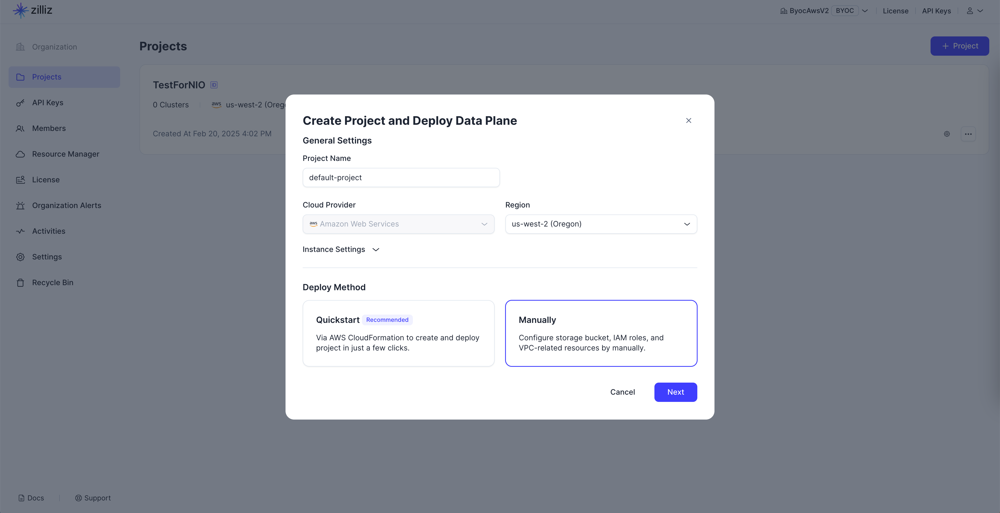
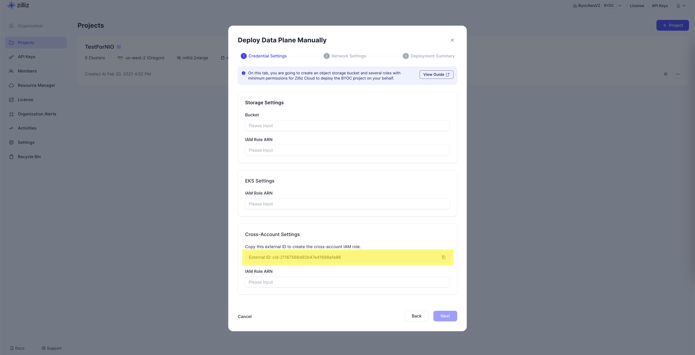

# Zilliz Cloud BYOC Project Setup Guide (On Console)

This guide explains how to configure a Bring-Your-Own-Cloud (BYOC) environment using the `zillizcloud_byoc_project` Terraform resource and Zilliz Cloud console. You'll deploy a fully managed Milvus cluster within your AWS infrastructure while maintaining complete control over your data and network environment.

## Table of Contents


## Prerequisites <a name="prerequisites"></a>

- **AWS Requirements**
  - AWS account with admin privileges
  - AWS CLI configured with credentials
  - Target region enabled in your AWS account

- **Zilliz Cloud Requirements**
  - Active Zilliz Cloud account
  - API credentials with project creation permissions

- **Tooling**
  - Terraform v1.0+


## Quick Start <a name="quick-start"></a>

### 1. Clone the script repository

In this step, you will use the following command to clone and pull the script repository.

```bash
git clone https://github.com/zilliztech/terraform-zilliz-examples.git
```

### 2. Prepare the Credentials

In this step, you are going to edit the `terraform.tfvars.json` file located within the `client_init` folder.

```bash
cd terraform-zilliz-examples/examples/aws_project_byoc_manual/
vi terraform.tfvars.json
```

The file is similar to the following:

```json
{
  "aws_region": "us-west-2",
  "vpc_cidr": "10.0.0.0/16",
  "name": "test-byoc-lcf",
  "ExternalId": "cid-xxxxxxxxxxxxxxxxxxxxxxxxx"
}
```

| Variable | Description |
| --- | --- |
| `aws_region` | The cloud region in which you will deploy Zilliz BYOC. <br/> Currently, you can deploy your BYOC project in `us-west-2`. If you need to deploy your BYOC project in other cloud regions, please [contact us](https://zilliz.com/contact-sales).|
| `vpc_cidr` | The CIDR block to be allocated within the customer-managed VPC. For example, 10.0.0.0/16. |
| `name` | The name of the BYOC project. <br/> Please align the value with the one you have entered in the form below.<br/>  |
| `ExternalId` | The **External ID** of the BYOC project to create.<br/> |

### 3. Bootstrap Infrastructure

Once you have prepared the credentials described above, bootstrap the infrastructure for the project as follows:

1. Run `terraform init` to prepare the environment.
2. Run `terraform plan` to clear errors. If any errors are reported, fix them, and then run the command again.
3. Run `terraform apply` to create the IAM roles, VPC, etc.

    The result might be similar to the following:

    ```plaintext
    bootstrap_role_arn = "arn:aws:iam::xxxxxxxxxxxx:role/zilliz-byoc-boostrap-role"
    bucket_name = "zilliz-byoc-bucket"
    eks-role-arn = "arn:aws:iam::xxxxxxxxxxxx:role/zilliz-byoc-eks-role"
    external_id = "cid-xxxxxxxxxxxxxxxxxxxxxxxxx"
    security_group_id = "sg-xxxxxxxxxxxxxxxxx"
    storage_role_arn = "arn:aws:iam::xxxxxxxxxxxx:role/zilliz-byoc-storage-role"
    subnet_id = [
    "subnet-xxxxxxxxxxxxxxxxx",
    "subnet-xxxxxxxxxxxxxxxxx",
    "subnet-xxxxxxxxxxxxxxxxx",
    ]
    vpc_id = "vpc-xxxxxxxxxxxxxxxxx"
    ```

4. Collection the following information and fill it back in on the Zilliz Cloud console

    - **Storage settings**

        | Paramter | Description |
        | --- | --- |
        | Bucket name | Use the value of the `bucket_name` variable in the command output.<br/>Zilliz Cloud uses the bucket as data plane storage. |
        | IAM role ARN | Use the value of the `storage_role_arn` variable in the command output.<br/>Zilliz Cloud uses the role to access the bucket. |

    - **EKS settings**

        | Paramter | Description |
        | --- | --- |
        | IAM role ARN | Use the value of the `eks-role-arn` variable in the command output.<br/>Zilliz Cloud uses the role t create and manage the EKS cluster. |

    - **Cross-account settings**

        | Paramter | Description |
        | --- | --- |
        | IAM role ARN | Use the value of the `bootstrap_role_arn` variable in the command output.<br/>By assuming the role, Zilliz Cloud can provision the data plane on your behalf. |

    - **Network settings**

        | Paramter | Description |
        | --- | --- |
        | VPC ID | Use the value of the `vpc_id` variable in the command output.<br/>Zilliz Cloud provisions the data plane and clusters of the BYOC project in this VPC. |
        | Subnet IDs | Use the values of the `subnet_id` variable in the command output.<br/>Zilliz Cloud requires a public subnet and three private subnets and deploys the NAT gateway in the public subnet to route the network traffic of the private subnets in each availability zone.<br/>You need to concatenate the three subnet IDs with commas as in `subnet_xxxxxxxxxxxxxxxxx,subnet_xxxxxxxxxxxxxxxxx,subnet_xxxxxxxxxxxxxxxxx`. |